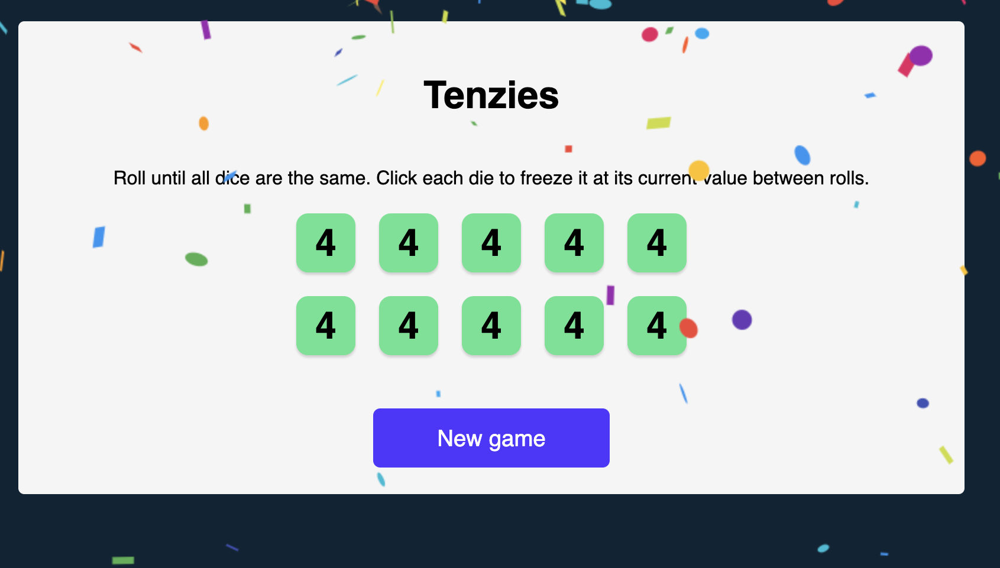

# React Project

## Tenzies

I developed this project after I completed Section 4 of React course on Scrimba.


The idea is to roll ten dice in the same.
- In the game, you can click a dice and hold it in green. 
- Then rolling with the button will not change the held dice(number)
- You try to finish the game until all of the dice are the same number by rolling dices
- As soon as we hold the last dice, the game will notice that the Numbers are all the same, and confetti will appear. 
- The button will change to "Reset Game" from "Roll"
- You can start a new game again
The aim is to create own meme with fun text and random images

## Deployment

[](https://yildiztugba.github.io/tenzies)


## Overview


## Tools and Technologies

- React
  - State, setState
  - UseEffect
  - Props,onClick
  - Child Component
  - map, every
  - npm packages: nanoid, react-confetti
  - Declarative methods

### Devops

- Github

## Setup

To run the app, type `npm start` in the CLI.

## Sample React code

Here is a look at how to create an array of child components which take props from die state and function in the parent.

```
const diceElements = dice.map(die => (
        <Die 
            key={die.id} 
            value={die.value} 
            isHeld={die.isHeld} 
            holdDice={() => holdDice(die.id)}
        />
    ))
```